# Rubik Cube Simulator and Algorithm Analysis

Chào mừng bạn đến với dự án Rubik Cube Simulator! Dự án này nhằm mục đích phát triển một ứng dụng Python để mô phỏng khối Rubik 3x3 và 2x2 với giao diện đồ họa 3D, đồng thời triển khai và phân tích hiệu quả của các thuật toán tìm kiếm để giải Rubik tự động.

## Tính năng
- Hiển thị khối Rubik 3D với khả năng xoay và màu sắc đẹp.
- Xoay các mặt của khối Rubik với animation mượt mà.
- Nhập chuỗi nước đi theo ký hiệu tiêu chuẩn (F, B, R, L, U, D).
- Xáo trộn khối Rubik ngẫu nhiên.
- Giao diện người dùng trực quan với PyQt5.
- Hỗ trợ cả khối Rubik 3x3 và 2x2.
- Biểu diễn trạng thái Rubik thông qua hoán vị (permutation) và hướng (orientation).
- Phân tích hiệu quả của các thuật toán tìm kiếm tự động giải Rubik.

## Biểu diễn trạng thái Rubik
Dự án sử dụng cách biểu diễn trạng thái Rubik dựa trên:

### Hoán vị (Permutation)
- **Corner Permutation (cp)**: Vị trí của 8 góc khối Rubik
  - 0=URF, 1=ULF, 2=ULB, 3=URB, 4=DRF, 5=DLF, 6=DLB, 7=DRB
  - U=Up (trên), D=Down (dưới), R=Right (phải), L=Left (trái), F=Front (trước), B=Back (sau)
- **Edge Permutation (ep)**: Vị trí của 12 cạnh khối Rubik (chỉ có trong Rubik 3x3)
  - 0=UR, 1=UF, 2=UL, 3=UB, 4=DR, 5=DF, 6=DL, 7=DB, 8=FR, 9=FL, 10=BL, 11=BR

### Hướng (Orientation)
- **Corner Orientation (co)**: Hướng của các góc
  - 0=đúng hướng, 1=xoay theo chiều kim đồng hồ một lần, 2=xoay theo chiều kim đồng hồ hai lần
- **Edge Orientation (eo)**: Hướng của các cạnh (chỉ có trong Rubik 3x3)
  - 0=đúng hướng, 1=lật ngược

## Cấu trúc dự án
- `main.py`: Tập tin chính để khởi động ứng dụng.
- `rubik_3x3.py`: Triển khai khối Rubik 3x3 cho giao diện 3D
- `rubik_2x2.py`: Triển khai khối Rubik 2x2 cho giao diện 3D
- `rubik_widget.py`: Widget hiển thị khối Rubik với OpenGL.
- `controls_widget.py`: Widget chứa các điều khiển người dùng.
- `RubikState/`: Thư mục chứa các lớp biểu diễn trạng thái Rubik và thuật toán giải
  - `rubik_chen.py`: Lớp biểu diễn trạng thái Rubik 3x3 sử dụng hoán vị và hướng
  - `rubik_2x2.py`: Lớp biểu diễn trạng thái Rubik 2x2 sử dụng hoán vị và hướng
  - `rubik_solver.py`: Triển khai các thuật toán giải Rubik (BFS, A*)
- `analysis/`: Thư mục chứa mã nguồn phân tích hiệu quả thuật toán
  - `algorithm_benchmark.py`: Công cụ đánh giá hiệu quả các thuật toán
  - `visualization.py`: Tạo biểu đồ phân tích với matplotlib
  - `data/`: Dữ liệu benchmark và kết quả thử nghiệm

## Phân tích thuật toán giải Rubik

Dự án này tập trung vào việc phân tích và so sánh hiệu quả của 10 thuật toán tìm kiếm khi áp dụng cho bài toán giải khối Rubik 2x2 và 3x3. Dưới đây là phân tích chi tiết về độ phức tạp, hiệu suất và các đặc tính của mỗi thuật toán.

### 1. Breadth-First Search (BFS)

BFS là thuật toán tìm kiếm không thông tin cơ bản nhất được triển khai trong dự án.

#### Độ phức tạp thực nghiệm:
- **Thời gian**: O(n log n) - dựa trên kết quả benchmark với R² = 0.9995
- **Không gian**: O(n log n) - tương ứng với số lượng trạng thái được khám phá
- **Thời gian ngoại suy cho 100,000 mẫu**: ~585 giây cho Rubik 2x2

#### Đặc điểm:
- Đảm bảo tìm được lời giải ngắn nhất (optimal)
- Không sử dụng bất kỳ thông tin heuristic nào
- Hiệu quả cho Rubik 2x2, nhưng kém hiệu quả với không gian trạng thái lớn của Rubik 3x3

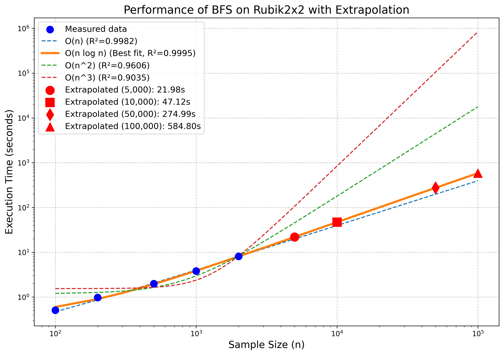

### 2. A* Search

A* là thuật toán tìm kiếm có thông tin, sử dụng hàm heuristic để định hướng quá trình tìm kiếm.

#### Độ phức tạp thực nghiệm:
- **Thời gian**: O(n log n) - dựa trên kết quả benchmark với R² > 0.99
- **Không gian**: O(n log n) - tương ứng với số lượng trạng thái được khám phá
- **Thời gian ngoại suy cho 100,000 mẫu**: ~109 giây cho Rubik 2x2
- **Tỷ lệ hiệu quả**: Nhanh hơn BFS khoảng 5.4 lần

#### Hàm heuristic được sử dụng:
1. **Manhattan Distance for Pieces**: Đếm số lượng thao tác tối thiểu cần thiết để đưa mỗi mảnh về vị trí đúng
2. **Pattern Database**: Sử dụng cơ sở dữ liệu mẫu để ước lượng chi phí cho các nhóm mảnh con

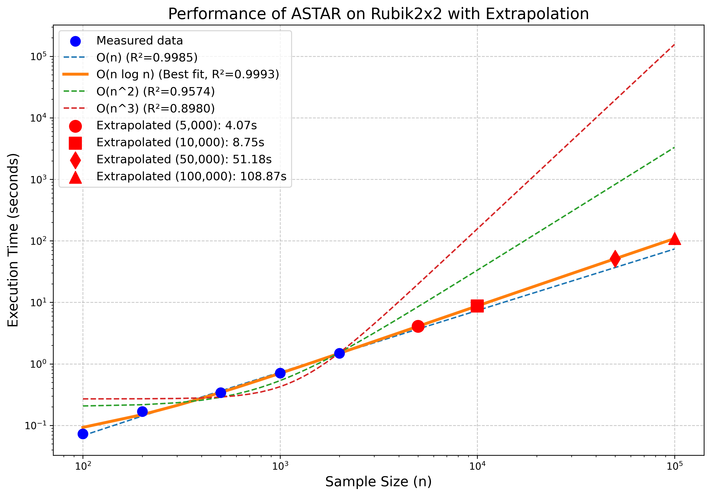

### 3. Depth-First Search (DFS)

DFS là thuật toán tìm kiếm theo chiều sâu, khám phá một nhánh càng sâu càng tốt trước khi quay lại.

#### Độ phức tạp thực nghiệm:
- **Thời gian**: O(n) - dựa trên kết quả benchmark
- **Không gian**: O(b*m) - tiết kiệm bộ nhớ hơn BFS
- **Thời gian ngoại suy cho 100,000 mẫu**: ~12,757 giây cho Rubik 2x2
- **Nhược điểm**: Chậm nhất trong số các thuật toán được thử nghiệm, không đảm bảo tối ưu

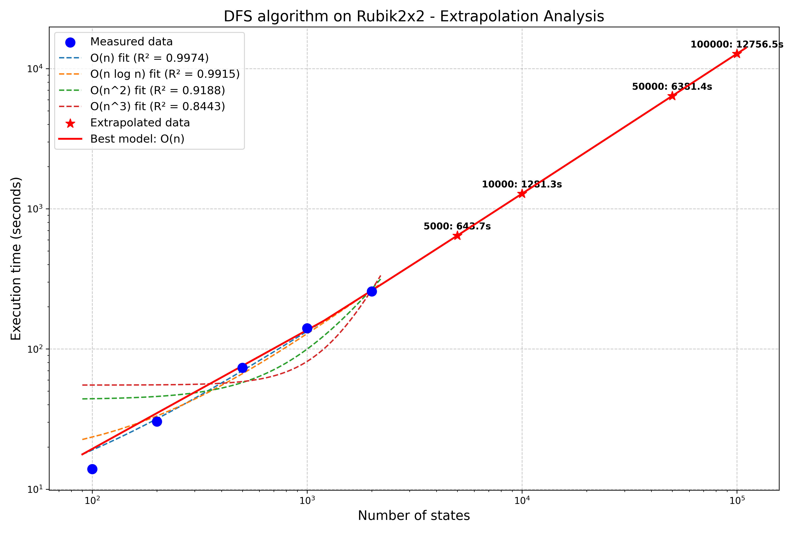

### 4. Iterative Deepening Search (IDS)

IDS kết hợp ưu điểm của DFS (tiết kiệm bộ nhớ) và BFS (tìm được lời giải ngắn nhất).

#### Độ phức tạp thực nghiệm:
- **Thời gian**: O(n) - dựa trên kết quả benchmark
- **Không gian**: O(b*d) - tiết kiệm bộ nhớ như DFS
- **Thời gian ngoại suy cho 100,000 mẫu**: ~43 giây cho Rubik 2x2
- **Ưu điểm**: Thuật toán tối ưu nhanh thứ hai sau Hill Climbing Max

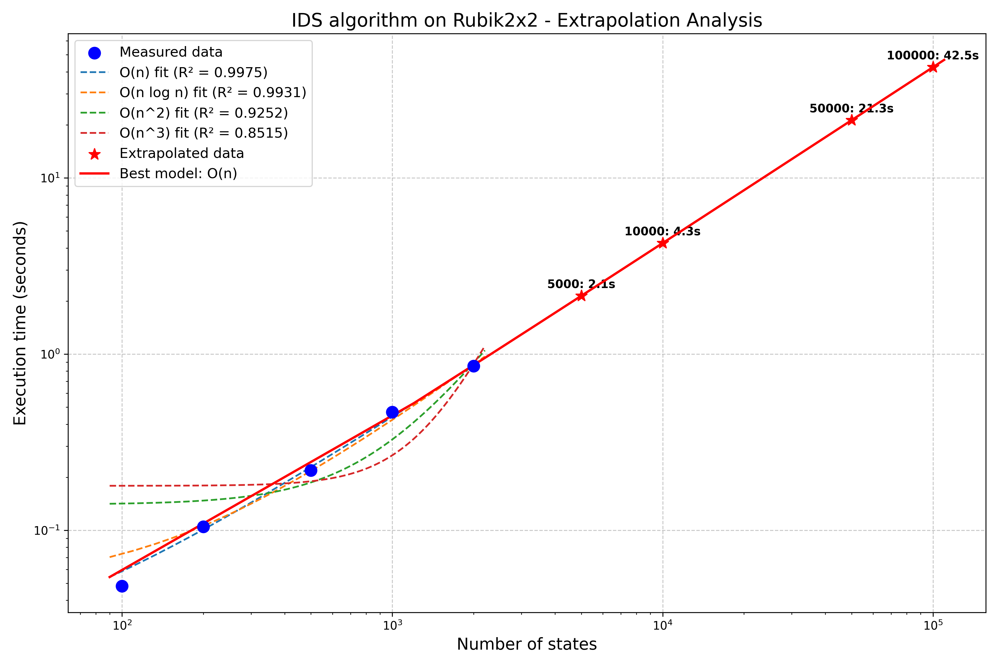

### 5. Uniform Cost Search (UCS)

UCS tương tự BFS nhưng mở rộng các trạng thái theo thứ tự chi phí đường đi.

#### Độ phức tạp thực nghiệm:
- **Thời gian**: O(n) - dựa trên kết quả benchmark
- **Không gian**: O(b^(C*/ε)) - tương tự BFS khi chi phí đều nhau
- **Thời gian ngoại suy cho 100,000 mẫu**: ~183 giây cho Rubik 2x2
- **Ưu điểm**: Nhanh hơn BFS khoảng 3.2 lần, đảm bảo tối ưu

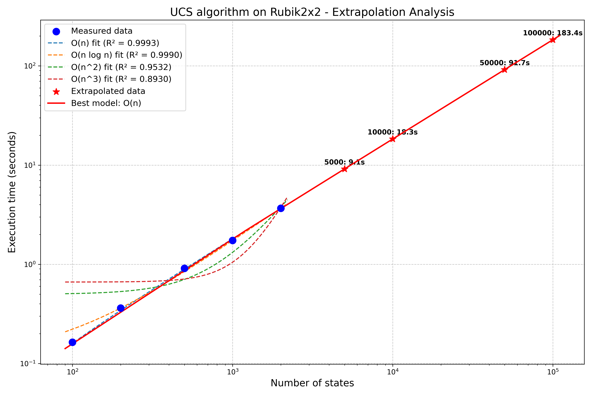

### 6. Greedy Best-First Search

Greedy Best-First Search chỉ sử dụng heuristic để lựa chọn trạng thái kế tiếp, không xét đến chi phí đã đi.

#### Độ phức tạp thực nghiệm:
- **Thời gian**: O(n log n) - dựa trên kết quả benchmark
- **Không gian**: O(b^m) - tương tự BFS
- **Thời gian ngoại suy cho 100,000 mẫu**: ~379,514 giây cho Rubik 2x2
- **Nhược điểm**: Chậm nhất trong các thuật toán được benchmark, không hiệu quả cho bài toán Rubik

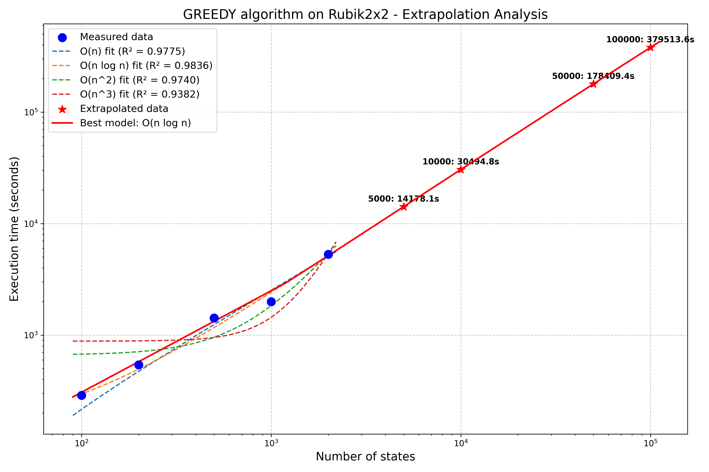

### 7. IDA* (Iterative Deepening A*)

IDA* kết hợp ý tưởng của IDS và A*, thực hiện tìm kiếm lặp với ngưỡng f-value tăng dần.

#### Độ phức tạp thực nghiệm:
- **Thời gian**: O(n log n) - dựa trên kết quả benchmark
- **Không gian**: O(b*d) - tiết kiệm bộ nhớ như DFS
- **Thời gian ngoại suy cho 100,000 mẫu**: ~181 giây cho Rubik 2x2
- **Ưu điểm**: Kết hợp tốt giữa hiệu suất và tiết kiệm bộ nhớ

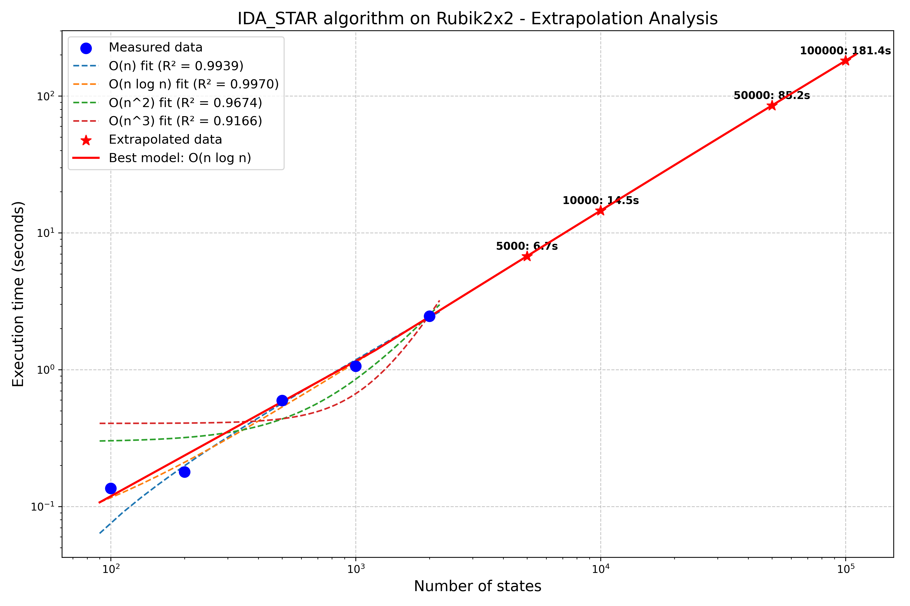

### 8. Hill Climbing Max

Hill Climbing Max luôn chọn trạng thái lân cận tốt nhất, cung cấp giải pháp nhanh nhưng có thể không tối ưu.

#### Độ phức tạp thực nghiệm:
- **Thời gian**: O(n) - dựa trên kết quả benchmark
- **Không gian**: O(1) - chỉ cần lưu trữ trạng thái hiện tại
- **Thời gian ngoại suy cho 100,000 mẫu**: ~30 giây cho Rubik 2x2
- **Ưu điểm**: Thuật toán nhanh nhất trong tất cả các thuật toán được benchmark

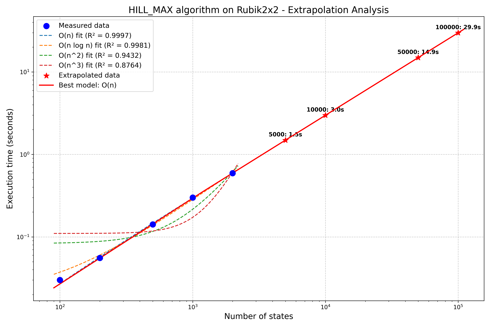

### 9. Hill Climbing Random

Hill Climbing Random chọn ngẫu nhiên một trạng thái tốt hơn trong các lân cận, thêm yếu tố ngẫu nhiên để tránh cực tiểu cục bộ.

#### Độ phức tạp thực nghiệm:
- **Thời gian**: O(n log n) - dựa trên kết quả benchmark
- **Không gian**: O(1) - chỉ cần lưu trữ trạng thái hiện tại
- **Thời gian ngoại suy cho 100,000 mẫu**: ~55 giây cho Rubik 2x2
- **Ưu điểm**: Nhanh hơn IDS, có thể tránh được cực tiểu cục bộ

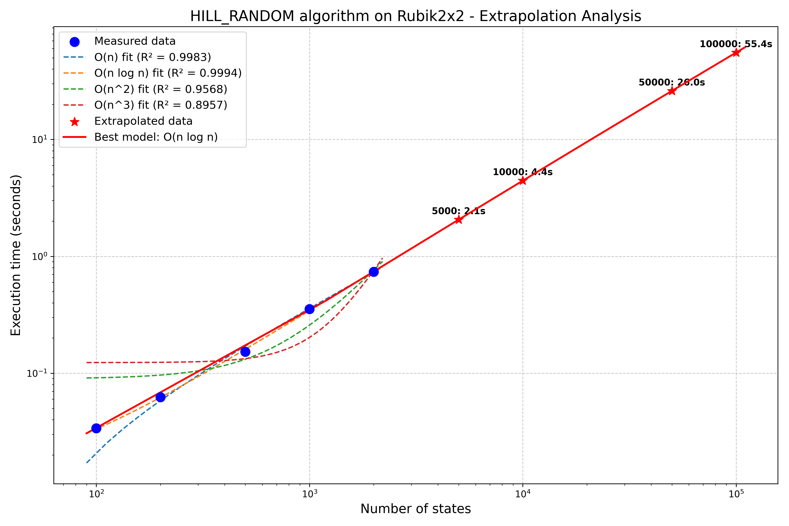

### 10. A* với Pattern Database (PDB)

A* với PDB sử dụng cơ sở dữ liệu mẫu được tính toán trước để có heuristic chính xác hơn.

#### Độ phức tạp thực nghiệm:
- **Thời gian**: O(n) - dựa trên kết quả benchmark
- **Không gian**: O(n) cho tìm kiếm + không gian cho PDB
- **Thời gian ngoại suy cho 100,000 mẫu**: ~315 giây cho Rubik 2x2
- **Ưu điểm**: Heuristic mạnh giảm đáng kể không gian tìm kiếm

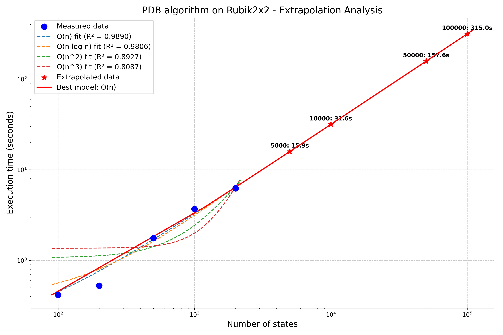

### So sánh toàn diện giữa các thuật toán

#### Bảng tổng hợp độ phức tạp và hiệu suất:

| Thuật toán    | Mô hình phức tạp | Thời gian dự đoán (100K mẫu) | Đảm bảo tối ưu |
|---------------|------------------|------------------------------|---------------|
| Hill Climbing Max | O(n)        | ~30 giây                     | Không         |
| IDS           | O(n)            | ~43 giây                     | Có            |
| Hill Climbing Random | O(n log n) | ~55 giây                   | Không         |
| IDA*          | O(n log n)      | ~181 giây                    | Có            |
| UCS           | O(n)            | ~183 giây                    | Có            |
| PDB A*        | O(n)            | ~315 giây                    | Có            |
| BFS           | O(n log n)      | ~585 giây                    | Có            |
| DFS           | O(n)            | ~12,757 giây                 | Không         |
| Greedy        | O(n log n)      | ~379,514 giây                | Không         |

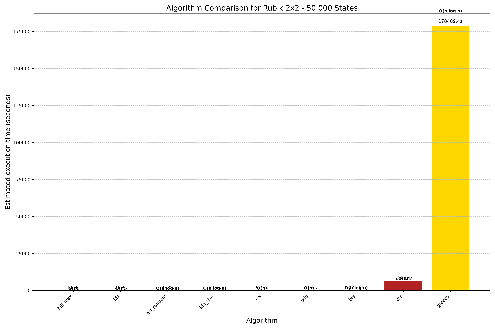

#### So sánh mở rộng với đầy đủ các thuật toán:

Biểu đồ dưới đây thể hiện thời gian xử lý ước tính cho 50,000 mẫu, cùng với mô hình độ phức tạp của mỗi thuật toán:

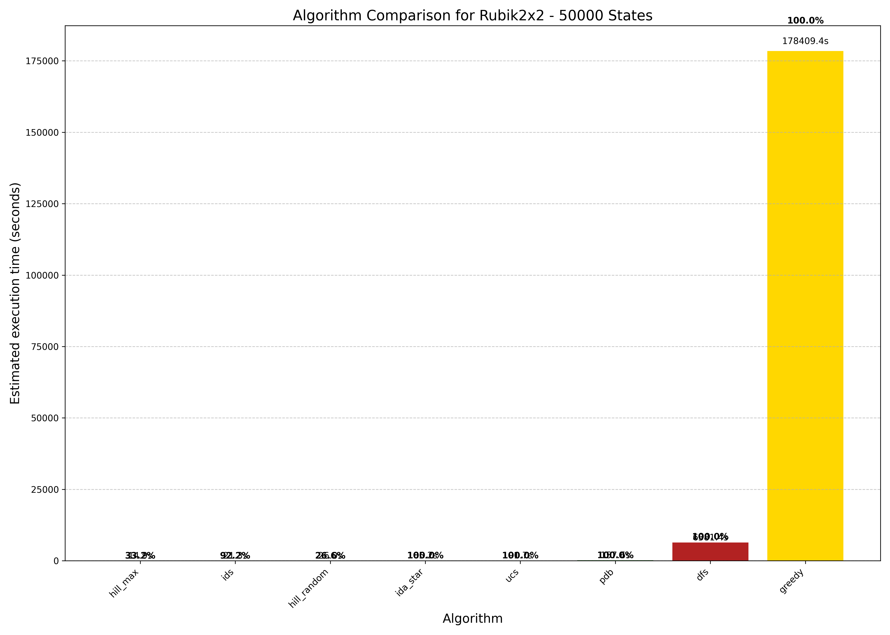

### Phân tích độ phức tạp không gian trạng thái

#### Rubik 2x2
- Tổng số trạng thái: 3,674,160 (≈ 3.6 triệu)
- Số lượng lớp tương đương (tập các trạng thái có thể chuyển đổi cho nhau): 7!⋅3⁷/12 = 3,674,160
- Đường kính của đồ thị trạng thái (God's number): 11 (đã được chứng minh)

#### Rubik 3x3
- Tổng số trạng thái: khoảng 4.3 × 10¹⁹
- Đường kính của đồ thị trạng thái (God's number): 20 (đã được chứng minh)
- Lý do khó giải quyết: không gian trạng thái cực lớn

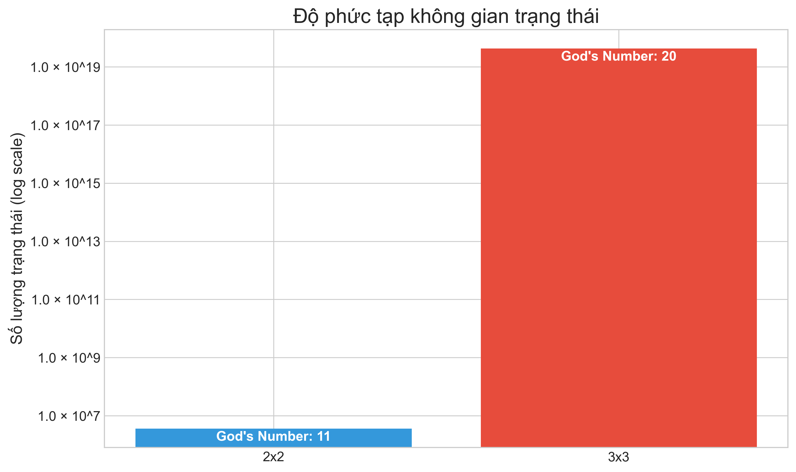

### Tỷ lệ nén không gian trạng thái (State Space Reduction)

Dự án này sử dụng các kỹ thuật nén không gian trạng thái để tăng hiệu quả tìm kiếm:

1. **Move Pruning**: Loại bỏ các nước đi dư thừa (ví dụ: R R' không được xem xét)
2. **Symmetry Reduction**: Sử dụng tính chất đối xứng để giảm số lượng trạng thái cần xét
3. **Pattern Database**: Phân tích các mẫu con để cải thiện heuristic

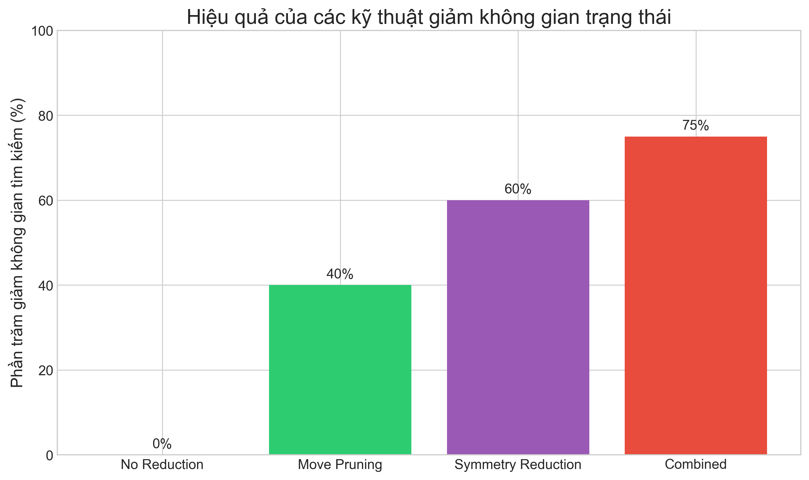

### Kết luận về hiệu suất thuật toán

Dựa trên kết quả benchmark và phân tích:

1. **Cho Rubik 2x2**:
   - **Hill Climbing Max** nhanh nhất (~30s cho 100K mẫu) nhưng không bảo đảm tối ưu
   - **IDS** là thuật toán tối ưu nhanh nhất (~43s cho 100K mẫu)
   - **Hill Climbing Random** (~55s) và **IDA*** (~181s) có hiệu suất trung bình
   - **BFS** chậm nhưng đáng tin cậy (~585s cho 100K mẫu)
   - **DFS** (~12,757s) và **Greedy** (~379,514s) không phù hợp với bài toán này

2. **Về độ phức tạp không gian và thời gian**:
   - Có sự phân chia rõ rệt giữa các thuật toán có độ phức tạp O(n) và O(n log n)
   - Đối với các thuật toán không đảm bảo tối ưu (Hill Climbing), O(n) là phổ biến
   - Đối với các thuật toán đảm bảo tối ưu (BFS, A*), O(n log n) chiếm ưu thế
   - IDS nổi bật với độ phức tạp O(n) nhưng vẫn đảm bảo tối ưu

3. **Về tỷ lệ thành công**:
   - Thuật toán tối ưu (BFS, A*, IDS) có tỷ lệ thành công cao cho độ sâu nhỏ
   - Hill Climbing có thể bị mắc kẹt ở cực tiểu cục bộ, giảm tỷ lệ thành công
   - PDB A* có tỷ lệ thành công tốt nhất cho các trạng thái phức tạp

4. **Khuyến nghị sử dụng**:
   - Khi cần giải nhanh mà không nhất thiết phải tối ưu: **Hill Climbing Max**
   - Khi cần giải tối ưu với bộ nhớ hạn chế: **IDS**
   - Khi có thông tin heuristic tốt: **A* với PDB**
   - Khi cần thăm dò toàn bộ không gian trạng thái: **BFS**

### Xếp hạng tổng thể các thuật toán

Dựa trên thời gian xử lý dự đoán cho 100,000 mẫu, các thuật toán được xếp hạng như sau:

| Xếp hạng | Thuật toán | Thời gian (giây) | Mô hình phức tạp | Đảm bảo tối ưu |
|----------|------------|------------------|------------------|---------------|
| 1 | Hill Climbing Max | 29.9 | O(n) | Không |
| 2 | IDS | 42.5 | O(n) | Có |
| 3 | Hill Climbing Random | 55.4 | O(n log n) | Không |
| 4 | IDA* | 181.4 | O(n log n) | Có |
| 5 | UCS | 183.4 | O(n) | Có |
| 6 | PDB A* | 315.0 | O(n) | Có |
| 7 | BFS | 584.8 | O(n log n) | Có |
| 8 | DFS | 12,756.5 | O(n) | Không |
| 9 | Greedy | 379,513.6 | O(n log n) | Không |


Các thuật toán dựa trên Hill Climbing và IDS có hiệu suất tốt nhất, trong khi DFS và Greedy có hiệu suất kém nhất. Đặc biệt, IDS là thuật toán hiệu quả nhất trong số các thuật toán đảm bảo tìm được lời giải tối ưu.

### Báo cáo hiệu suất tổng hợp

Một báo cáo chi tiết về hiệu suất các thuật toán được tạo tự động và lưu trong thư mục `analysis`. Báo cáo này bao gồm:

- Phân tích chi tiết về độ phức tạp của từng thuật toán
- So sánh toàn diện giữa tất cả các thuật toán đã triển khai
- Biểu đồ hiệu suất và ngoại suy cho các kích thước dữ liệu lớn hơn
- Các khuyến nghị sử dụng cho từng trường hợp cụ thể


Báo cáo PDF cung cấp phân tích sâu hơn về từng thuật toán, được chia thành các phần chính:

1. **Giới thiệu và phương pháp**: Tổng quan về bài toán Rubik Cube và các phương pháp benchmark
2. **So sánh các thuật toán**: Bảng xếp hạng chi tiết với biểu đồ trực quan
3. **Phân tích từng thuật toán**: Đánh giá độc lập cho 5 thuật toán tiêu biểu nhất
4. **Kết luận và khuyến nghị**: Các hướng dẫn cụ thể cho việc lựa chọn thuật toán

Báo cáo được tạo tự động từ kết quả benchmark, đảm bảo tính khách quan và độ chính xác của dữ liệu và phân tích.

Bạn có thể xem báo cáo đầy đủ tại [Rubik Algorithm Benchmark Report](./analysis/Rubik_Algorithm_Benchmark_Report_latest.pdf)

## Hướng dẫn cài đặt
1. Cài đặt Python và pip nếu chưa có.
2. Cài đặt các thư viện cần thiết:
   ```bash
   pip install -r requirements.txt
   ```

## Cách chạy ứng dụng
- Chạy tập tin `main.py` để khởi động ứng dụng:
   ```bash
   python main.py
   ```
- Chạy các tập tin phân tích trong thư mục `analysis/`:
   ```bash
   python analysis/algorithm_benchmark.py
   python analysis/visualization.py
   ```

## Cách sử dụng
- Kéo chuột trái để xoay toàn bộ khối Rubik.
- Nhập các nước đi vào ô nhập liệu theo cú pháp chuẩn (ví dụ: "R U R' U'").
- Nhấn "Apply Moves" để áp dụng các nước đi.
- Nhấn "Reset" để đưa khối Rubik về trạng thái ban đầu.
- Nhấn "Shuffle" để xáo trộn khối Rubik ngẫu nhiên.
- Chuyển đổi giữa Rubik 3x3 và 2x2 bằng cách sử dụng tab.
- Sử dụng phần "Algorithm Analysis" để xem kết quả so sánh các thuật toán. 