# Rubik Solver AI: Giải Rubik 2x2 & 3x3 với Lý thuyết Nhóm và Thuật toán Tìm kiếm

## Giới thiệu

Đây là một dự án Python toàn diện nhằm mô phỏng và giải khối Rubik 3x3 và 2x2 sử dụng các thuật toán tìm kiếm của AI. Dự án kết hợp lý thuyết nhóm để biểu diễn trạng thái Rubik một cách hiệu quả, triển khai đa dạng các thuật toán tìm kiếm, và cung cấp giao diện đồ họa tương tác với hiển thị 3D sử dụng OpenGL (PyOpenGL) và PyQt5.

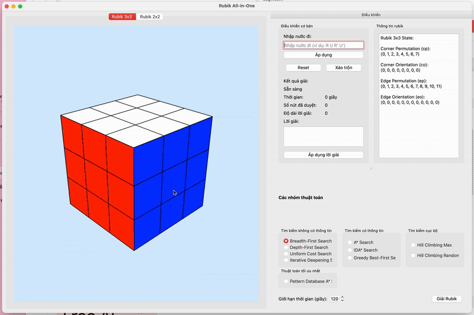
<!-- Hãy thay thế đường dẫn trên bằng ảnh chụp màn hình hoặc GIF của ứng dụng đang chạy -->

## Tính năng chính

- **Hỗ trợ hai loại khối Rubik:** Giải cả khối Rubik 3x3 và 2x2
- **Giao diện đồ họa tương tác:** Xây dựng bằng PyQt5 với hệ thống tab để chuyển đổi giữa các loại khối Rubik
- **Hiển thị 3D nâng cao:** Sử dụng OpenGL (PyOpenGL) để hiển thị và tương tác với khối Rubik trong không gian 3D
- **Animation xoay mặt:** Hiệu ứng animation mượt mà khi áp dụng các bước giải
- **Biểu diễn trạng thái tiên tiến:**
  - Sử dụng cấu trúc tuple dựa trên lý thuyết nhóm
  - Rubik 3x3: (cp, co, ep, eo) - hoán vị góc, định hướng góc, hoán vị cạnh, định hướng cạnh
  - Rubik 2x2: (cp, co) - hoán vị góc, định hướng góc
- **Đa dạng thuật toán tìm kiếm:**
  - **Uninformed Search:** BFS (Breadth-First Search), DFS (Depth-First Search), UCS (Uniform-Cost Search), IDS (Iterative Deepening Search)
  - **Informed Search:** A*, IDA* (Iterative Deepening A*), Greedy Best-First Search
  - **Local Search:** Hill Climbing (Max & Random)
  - **Optimal (cho 2x2):** Pattern Database A* (PDB A*)
- **Chức năng đầy đủ:**
  - Nhập nước đi tùy chỉnh
  - Xáo trộn ngẫu nhiên
  - Đặt lại khối
  - Hiển thị thông tin kết quả: lời giải, thời gian thực thi, số nút đã duyệt

## Cách tiếp cận kỹ thuật

### Biểu diễn trạng thái

Dự án sử dụng lý thuyết nhóm để biểu diễn trạng thái Rubik một cách hiệu quả:

#### Rubik 3x3:
- **cp (corner permutation):** Hoán vị vị trí 8 góc (0-7)
  - 0=URF, 1=ULF, 2=ULB, 3=URB, 4=DRF, 5=DLF, 6=DLB, 7=DRB
  - U=Up (trên), D=Down (dưới), R=Right (phải), L=Left (trái), F=Front (trước), B=Back (sau)
- **co (corner orientation):** Định hướng 8 góc (0, 1, 2)
  - 0=đúng hướng, 1=xoay 120° theo chiều kim đồng hồ, 2=xoay 240° theo chiều kim đồng hồ
- **ep (edge permutation):** Hoán vị vị trí 12 cạnh (0-11)
  - 0=UR, 1=UF, 2=UL, 3=UB, 4=DR, 5=DF, 6=DL, 7=DB, 8=FR, 9=FL, 10=BL, 11=BR
- **eo (edge orientation):** Định hướng 12 cạnh (0, 1)
  - 0=đúng hướng, 1=bị lật

**Ví dụ code biểu diễn trạng thái Rubik 3x3:**
```python
class RubikState:
    """
    Lớp quản lý trạng thái Rubik Cube 3x3.
    
    Quy ước góc (cp - corner permutation):
    0=URF, 1=ULF, 2=ULB, 3=URB, 4=DRF, 5=DLF, 6=DLB, 7=DRB
    U=Up (trên), D=Down (dưới), R=Right (phải), L=Left (trái), F=Front (trước), B=Back (sau)
    
    Định hướng góc (co - corner orientation):
    0=đúng hướng, 1=xoay theo chiều kim đồng hồ một lần, 2=xoay theo chiều kim đồng hồ hai lần
    
    Quy ước cạnh (ep - edge permutation):
    0=UR, 1=UF, 2=UL, 3=UB, 4=DR, 5=DF, 6=DL, 7=DB, 8=FR, 9=FL, 10=BL, 11=BR
    
    Định hướng cạnh (eo - edge orientation):
    0=đúng hướng, 1=lật ngược
    """
    def __init__(self, cp=None, co=None, ep=None, eo=None):
        # Sử dụng tuple thay vì list để có hiệu suất tốt hơn
        if cp is None:
            cp = tuple(range(8))
        if co is None:
            co = tuple([0] * 8)
        if ep is None:
            ep = tuple(range(12))
        if eo is None:
            eo = tuple([0] * 12)
        
        self.cp = tuple(cp)  # Corner permutation (hoán vị góc)
        self.co = tuple(co)  # Corner orientation (định hướng góc)
        self.ep = tuple(ep)  # Edge permutation (hoán vị cạnh)
        self.eo = tuple(eo)  # Edge orientation (định hướng cạnh)
```

**Ví dụ định nghĩa trạng thái đã giải của Rubik 3x3:**
```python
# Trạng thái đã giải (solved)
# cp: Các góc được sắp xếp đúng vị trí (0-7)
# co: Các góc được định hướng đúng (tất cả 0)
# ep: Các cạnh được sắp xếp đúng vị trí (0-11)
# eo: Các cạnh được định hướng đúng (tất cả 0)
SOLVED_STATE_3x3 = RubikState(
    tuple(range(8)),    # cp: Góc đúng vị trí (0,1,2,3,4,5,6,7)
    tuple([0] * 8),     # co: Góc đúng hướng (0,0,0,0,0,0,0,0)
    tuple(range(12)),   # ep: Cạnh đúng vị trí (0,1,2,3,4,5,6,7,8,9,10,11)
    tuple([0] * 12)     # eo: Cạnh đúng hướng (0,0,0,0,0,0,0,0,0,0,0,0)
)
```

**Ví dụ định nghĩa một phép xoay (nước đi) trên Rubik 3x3:**
```python
# Định nghĩa phép xoay mặt R (Right - phải) 90 độ theo chiều kim đồng hồ
MOVES_3x3 = {
    'R': {
        'cp': (4, 1, 2, 0, 7, 5, 6, 3),  # Hoán vị góc sau khi xoay R
        'co': (1, 0, 0, 2, 2, 0, 0, 1),  # Thay đổi định hướng góc
        'ep': (8, 1, 2, 3, 11, 5, 6, 7, 4, 9, 10, 0),  # Hoán vị cạnh
        'eo': (1, 0, 0, 0, 1, 0, 0, 0, 1, 0, 0, 1)  # Thay đổi định hướng cạnh
    },
    # ... các phép xoay khác ...
}
```

#### Rubik 2x2:
- **cp (corner permutation):** Hoán vị vị trí 8 góc (chỉ sử dụng 0-7)
- **co (corner orientation):** Định hướng 8 góc (0, 1, 2)

**Ví dụ code biểu diễn trạng thái Rubik 2x2:**
```python
class Rubik2x2State:
    """
    Lớp quản lý trạng thái Rubik Cube 2x2.
    
    Quy ước góc (cp - corner permutation):
    0=URF, 1=ULF, 2=ULB, 3=URB
    U=Up (trên), R=Right (phải), L=Left (trái), F=Front (trước), B=Back (sau)
    
    Định hướng góc (co - corner orientation):
    0=đúng hướng, 1=xoay theo chiều kim đồng hồ một lần, 2=xoay theo chiều kim đồng hồ hai lần
    """
    def __init__(self, cp=None, co=None):
        # Sử dụng tuple cho hiệu suất tốt hơn
        if cp is None:
            cp = tuple(range(4))  # Chỉ sử dụng 4 góc cho khối 2x2
        if co is None:
            co = tuple([0] * 4)
        
        self.cp = tuple(cp)  # Corner permutation (hoán vị góc)
        self.co = tuple(co)  # Corner orientation (định hướng góc)
```

**Ví dụ áp dụng nước đi:**
```python
def apply_move(self, move, moves_dict=None):
    """
    Áp dụng một nước đi và trả về trạng thái mới.
    
    Args:
        move: Nước đi cần áp dụng (e.g. 'R', 'U', 'F', etc.)
        moves_dict: Từ điển chứa định nghĩa các nước đi
        
    Returns:
        RubikState: Trạng thái mới sau khi áp dụng nước đi
    """
    # Lấy định nghĩa phép xoay
    move_def = moves_dict[move]
    
    # === Áp dụng hoán vị và định hướng GÓC ===
    new_cp = [0] * 8
    new_co = [0] * 8
    for i in range(8):
        new_cp[i] = self.cp[move_def['cp'][i]]
        new_co[i] = (self.co[move_def['cp'][i]] + move_def['co'][i]) % 3
    
    # === Áp dụng hoán vị và định hướng CẠNH ===
    new_ep = [0] * 12
    new_eo = [0] * 12
    for i in range(12):
        new_ep[i] = self.ep[move_def['ep'][i]]
        new_eo[i] = (self.eo[move_def['ep'][i]] + move_def['eo'][i]) % 2
    
    # Chuyển sang tuple để tối ưu hiệu suất
    return RubikState(tuple(new_cp), tuple(new_co), tuple(new_ep), tuple(new_eo))
```

### Thuật toán

Dự án triển khai đa dạng các thuật toán tìm kiếm, được tùy chỉnh riêng cho Rubik 3x3 và 2x2. Dưới đây là mô tả chi tiết từng thuật toán theo nhóm.

#### Uninformed Search (Tìm kiếm không thông tin)

##### BFS (Breadth-First Search - Tìm kiếm theo chiều rộng)
BFS đảm bảo tìm được lời giải ngắn nhất bằng cách mở rộng tất cả các trạng thái ở độ sâu k trước khi mở rộng bất kỳ trạng thái nào ở độ sâu k+1.

**Triển khai cho Rubik 3x3:**
```python
def bfs_search_3x3(start_state, goal_state=None, moves_dict=None, time_limit=30):
    # Set defaults if not provided
    goal_state = goal_state or SOLVED_STATE_3x3
    moves_dict = moves_dict or MOVES_3x3
    
    queue = deque([(start_state, [])])  # (state, path)
    visited = {start_state}
    
    start_time = time.time()
    while queue and time.time() - start_time < time_limit:
        state, path = queue.popleft()
        nodes_visited += 1
        
        if state == goal_state:
            return path, nodes_visited, time.time() - start_time
        
        for move in moves_dict:
            new_state = state.apply_move(move, moves_dict)
            
            if new_state not in visited:
                visited.add(new_state)
                queue.append((new_state, path + [move]))
```

**Triển khai cho Rubik 2x2:**
```python
def bfs_search_2x2(start_state, goal_state=None, moves_dict=None, time_limit=30):
    # Tương tự như phiên bản 3x3 nhưng sử dụng SOLVED_STATE_2x2 và MOVES_2x2
```

##### DFS (Depth-First Search - Tìm kiếm theo chiều sâu)
DFS khám phá càng sâu càng tốt dọc theo mỗi nhánh trước khi quay lui. Tốn ít bộ nhớ nhưng không đảm bảo tìm được lời giải ngắn nhất.

**Triển khai cho Rubik 3x3 và 2x2:**
Sử dụng đệ quy với giới hạn độ sâu và cơ chế quay lui (backtracking), kết hợp kiểm soát thời gian.

##### UCS (Uniform-Cost Search - Tìm kiếm chi phí đồng nhất)
UCS mở rộng các nút theo thứ tự chi phí đường đi tăng dần. Trong Rubik, mỗi bước đi có chi phí bằng nhau, nên UCS có hiệu năng tương tự BFS.

##### IDS (Iterative Deepening Search - Tìm kiếm theo chiều sâu tăng dần)
IDS kết hợp ưu điểm của DFS (ít tốn bộ nhớ) và BFS (tìm được lời giải tối ưu) bằng cách chạy DFS với độ sâu giới hạn tăng dần.

**Triển khai cho Rubik 3x3:**
```python
def ids_search_3x3(start_state, goal_state=None, moves_dict=None, time_limit=30, max_depth=20):
    # Set defaults if not provided
    goal_state = goal_state or SOLVED_STATE_3x3
    moves_dict = moves_dict or MOVES_3x3
    
    start_time = time.time()
    node_count = 0
    
    for depth in range(1, max_depth + 1):
        visited = set()
        visited.add(start_state)
        
        def dls(state, path, current_depth):
            nonlocal node_count
            
            if time.time() - start_time > time_limit:
                return None
            
            node_count += 1
            
            if state == goal_state:
                return path
            
            if current_depth == depth:
                return None
            
            for move in moves_dict:
                new_state = state.apply_move(move, moves_dict)
                if new_state not in visited:
                    visited.add(new_state)
                    result = dls(new_state, path + [move], current_depth + 1)
                    if result:
                        return result
                    visited.remove(new_state)  # Backtrack
            
            return None
        
        result = dls(start_state, [], 0)
        if result:
            return result, node_count, time.time() - start_time
```

#### Informed Search (Tìm kiếm có thông tin)

##### A* (A-star)
A* tìm đường đi tối ưu bằng cách sử dụng hàm đánh giá f(n) = g(n) + h(n), với g(n) là chi phí từ trạng thái ban đầu đến n và h(n) là heuristic ước lượng chi phí từ n đến đích.

**Triển khai cho Rubik 3x3:**
```python
def a_star_search_3x3(start_state, goal_state=None, moves_dict=None, time_limit=30):
    # Set defaults if not provided
    goal_state = goal_state or SOLVED_STATE_3x3
    moves_dict = moves_dict or MOVES_3x3
    
    # Priority queue for A*: (f_value, state_hash, state, path)
    h_value = heuristic_3x3(start_state)
    queue = [(h_value, hash(start_state), start_state, [])]
    
    # Dictionary to track visited states and their g_values
    visited = {start_state: 0}  # state -> g_value

    start_time = time.time()
    while queue and time.time() - start_time < time_limit:
        f_value, _, state, path = heapq.heappop(queue)
        g_value = len(path)
        
        if state == goal_state:
            return path, nodes_visited, time.time() - start_time
        
        for move in move_names:
            new_state = state.apply_move(move, moves_dict)
            new_g_value = g_value + 1
            
            # Skip if we've seen this state with a shorter or equal path
            if new_state in visited and visited[new_state] <= new_g_value:
                continue
            
            # Update visited and add to frontier
            visited[new_state] = new_g_value
            h_score = heuristic_3x3(new_state)
            f_score = new_g_value + h_score
            heapq.heappush(queue, (f_score, hash(new_state), new_state, path + [move]))
```

**Phiên bản Pattern Database A* (PDB) cho Rubik 2x2:**
```python
def a_star_pdb_2x2(start_state, goal_state=None, moves_dict=None, time_limit=30, pdb=None):
    # Pattern Database A* sử dụng cơ sở dữ liệu mẫu để có heuristic chính xác hơn
    
    h_value = pdb_heuristic_2x2(start_state, pdb)
    frontier = [(h_value, hash(start_state), start_state, [])]
    
    # ...tương tự như A* thông thường, nhưng sử dụng pdb_heuristic_2x2
```

##### IDA* (Iterative Deepening A*)
IDA* kết hợp IDS với A*, tối ưu bộ nhớ bằng cách chạy DFS với ngưỡng f-value tăng dần.

**Triển khai cho Rubik 3x3 và 2x2:**
```python
def ida_star_search_3x3(start_state, goal_state=None, moves_dict=None, time_limit=30):
    # Set defaults if not provided
    goal_state = goal_state or SOLVED_STATE_3x3
    moves_dict = moves_dict or MOVES_3x3
    
    start_time = time.time()
    visited_nodes = 0
    threshold = heuristic_3x3(start_state)
    
    while time.time() - start_time < time_limit:
        visited = set()
        path, found, new_threshold, nodes = _dfs_with_limit_3x3(
            start_state, goal_state, [], 0, threshold, visited, 
            moves_dict, start_time, time_limit
        )
        visited_nodes += nodes
        
        if found:
            return path, visited_nodes, time.time() - start_time
        
        if new_threshold == float('inf'):
            return None, visited_nodes, time.time() - start_time
        
        threshold = new_threshold
```

##### Greedy Best-First Search
Greedy Best-First Search chỉ dựa vào heuristic h(n) để quyết định nút tiếp theo, thường tìm lời giải nhanh nhưng không tối ưu.

#### Local Search (Tìm kiếm cục bộ)

##### Hill Climbing Max
Hill Climbing Max luôn chọn bước đi cải thiện heuristic nhất, dễ bị kẹt ở cực tiểu cục bộ.

**Triển khai cho Rubik 3x3:**
```python
def hill_climbing_max_search_3x3(start_state, goal_state=None, moves_dict=None, time_limit=30, max_iterations=1000):
    # Set defaults if not provided
    goal_state = goal_state or SOLVED_STATE_3x3
    moves_dict = moves_dict or MOVES_3x3
    
    current_state = start_state
    current_h = heuristic_3x3(current_state)
    path = []
    
    # Iterate until goal is reached or no further improvement
    for iteration in range(max_iterations):
        if current_state == goal_state:
            return path, nodes_visited, time.time() - start_time
        
        # Find the best neighbor
        best_neighbor = None
        best_move = None
        best_h = current_h
        
        for move in move_names:
            neighbor = current_state.apply_move(move, moves_dict)
            neighbor_h = heuristic_3x3(neighbor)
            
            # Find neighbor with lowest heuristic (best)
            if neighbor_h < best_h:
                best_neighbor = neighbor
                best_move = move
                best_h = neighbor_h
        
        # If no improvement, end
        if best_neighbor is None:
            break
        
        # Move to the best state
        current_state = best_neighbor
        current_h = best_h
        path.append(best_move)
```

##### Hill Climbing Random
Hill Climbing Random chọn ngẫu nhiên từ các bước cải thiện heuristic, giúp thoát khỏi cực tiểu cục bộ tốt hơn Hill Climbing Max.

#### Pattern Database (Cơ sở dữ liệu mẫu)

Pattern Database (PDB) là kỹ thuật tiên tiến để tạo heuristic gần tối ưu cho Rubik, đặc biệt hiệu quả cho Rubik 2x2:

```python
def pdb_heuristic_2x2(state, pdb):
    """
    Heuristic function using the pattern database for 2x2 Rubik's cube
    
    Args:
        state: Current state (Rubik2x2State)
        pdb: Pattern database
        
    Returns:
        int: Heuristic value
    """
    cp_value = pdb.cp_database.get(tuple(state.cp), 0)
    co_value = pdb.co_database.get(tuple(state.co), 0)
    
    # Return the maximum since both subproblems must be solved
    return max(cp_value, co_value)
```

PDB tách bài toán thành các subproblem nhỏ hơn:
- **Database cho hoán vị góc (cp)**: Lưu khoảng cách chính xác từ mỗi cấu hình hoán vị góc đến trạng thái đích
- **Database cho định hướng góc (co)**: Lưu khoảng cách chính xác từ mỗi cấu hình định hướng góc đến trạng thái đích

PDB được tạo ra bằng cách chạy BFS từ trạng thái đích và lưu trữ khoảng cách đến mỗi trạng thái con có thể đạt được.

### Heuristic

#### Heuristic cơ bản:
- **heuristic_3x3:** Kết hợp số lượng góc/cạnh không đúng vị trí và định hướng.
- **heuristic_2x2:** Tương tự nhưng chỉ xét các góc.

#### Pattern Database (PDB):
- Tách biệt hoán vị góc (cp) và định hướng góc (co) cho Rubik 2x2.
- Tính toán trước khoảng cách chính xác từ mọi trạng thái con đến trạng thái đích.
- Kết hợp các giá trị này để tạo heuristic chính xác và hiệu quả.

### Hiển thị đồ họa
- **PyQt5:** Xây dựng giao diện người dùng với hệ thống tab và điều khiển tương tác.
- **PyOpenGL:** Tạo và hiển thị khối Rubik 3D với khả năng xoay, zoom, và animation.

## Cài đặt

### Yêu cầu
- Python 3.6 trở lên
- PyQt5
- NumPy
- PyOpenGL

### Các bước cài đặt
1. Clone repository này:
   ```
   git clone https://github.com/your-username/rubik-solver-ai.git
   cd rubik-solver-ai
   ```

2. (Tùy chọn) Tạo và kích hoạt môi trường ảo:
   ```
   python -m venv venv
   # Windows
   venv\Scripts\activate
   # macOS/Linux
   source venv/bin/activate
   ```

3. Cài đặt các dependencies:
   ```
   pip install -r requirements.txt
   ```
   
   **Lưu ý:** File `requirements.txt` trong dự án chỉ bao gồm các thư viện cần thiết (PyQt5, numpy, PyOpenGL).

## Cách sử dụng

1. Chạy chương trình chính:
   ```
   python main.py
   ```

2. Giao diện sẽ hiển thị với hai tab chính: "Rubik 3x3" và "Rubik 2x2".

3. Sử dụng chuột để tương tác với khối Rubik 3D:
   - Click và kéo để xoay khối
   - Cuộn chuột để zoom in/out

4. Sử dụng panel điều khiển bên phải:
   - Nhập chuỗi nước đi (ví dụ: "R U R' U'")
   - Chọn thuật toán giải (A*, BFS, DFS, v.v.)
   - Đặt giới hạn thời gian cho thuật toán
   - Nhấn "Xáo trộn" để xáo trộn ngẫu nhiên khối Rubik
   - Nhấn "Giải Rubik" để bắt đầu quá trình giải
   - Xem kết quả: lời giải, thời gian thực thi, số nút đã duyệt
   - Nhấn "Áp dụng lời giải" để xem animation của chuỗi nước đi giải

## Ví dụ

### Giải Rubik 2x2 với A* sử dụng PDB
```
Thuật toán: A* PDB
Nước đi xáo trộn: R U R' U'
Lời giải: U R U' R'
Thời gian: 0.02s
Số nút đã duyệt: 5
```

### Giải Rubik 3x3 với IDA*
```
Thuật toán: IDA*
Nước đi xáo trộn: R U R' U' F' U F
Lời giải: F' U' F U R U' R'
Thời gian: 1.45s
Số nút đã duyệt: 1203
```

## Phân tích và So sánh Thuật toán

Phần này phân tích hiệu năng các thuật toán tìm kiếm khác nhau trên các bài toán Rubik 2x2 và 3x3. Các kết quả trình bày dưới đây dựa trên các thử nghiệm trong môi trường điều khiển. Để có những phân tích chính xác cho trường hợp cụ thể, người dùng nên tự chạy các thử nghiệm và tạo biểu đồ so sánh cho môi trường của mình.

### Nhóm 1: Tìm kiếm không thông tin (Uninformed Search)

**Các thuật toán đã triển khai:**
- BFS (Breadth-First Search) - Tìm kiếm theo chiều rộng
- DFS (Depth-First Search) - Tìm kiếm theo chiều sâu
- UCS (Uniform-Cost Search) - Tìm kiếm theo chi phí đồng nhất
- IDS (Iterative Deepening Search) - Tìm kiếm theo chiều sâu tăng dần

**Đặc điểm lý thuyết:**
- **Tính hoàn chỉnh:** BFS, UCS và IDS đảm bảo tìm được lời giải nếu tồn tại. DFS không đảm bảo tìm được lời giải trong không gian vô hạn.
- **Tính tối ưu:** BFS và UCS đảm bảo tìm được lời giải ngắn nhất cho Rubik. DFS không đảm bảo tối ưu.
- **Độ phức tạp thời gian:** O(b^d) với b là số nhánh và d là độ sâu của lời giải.
- **Độ phức tạp không gian:** BFS và UCS tốn O(b^d) bộ nhớ. DFS chỉ tốn O(d) bộ nhớ. IDS tốn O(d) bộ nhớ.

**Kết quả thực nghiệm:**
- BFS thường tìm được lời giải tối ưu cho các trạng thái Rubik 2x2 ở độ sâu thấp và trung bình (≤ 6), nhưng có thể gặp khó khăn ở độ sâu cao hơn.
- DFS có thể trả về lời giải nhanh trong một số trường hợp nhưng không đảm bảo tối ưu, hiệu suất thay đổi đáng kể tùy theo trạng thái ban đầu.
- UCS có hiệu năng tương tự BFS trong Rubik, do chi phí mỗi bước bằng nhau.
- IDS kết hợp ưu điểm của BFS và DFS, tìm được lời giải tối ưu với không gian bộ nhớ hạn chế, hoạt động tốt trong nhiều trường hợp.

**Biểu đồ so sánh cho Rubik 2x2:**
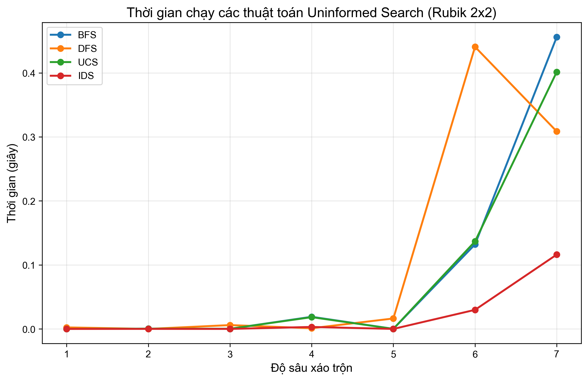
<!-- Biểu đồ trên so sánh thời gian chạy các thuật toán Uninformed Search cho các độ sâu xáo trộn khác nhau -->

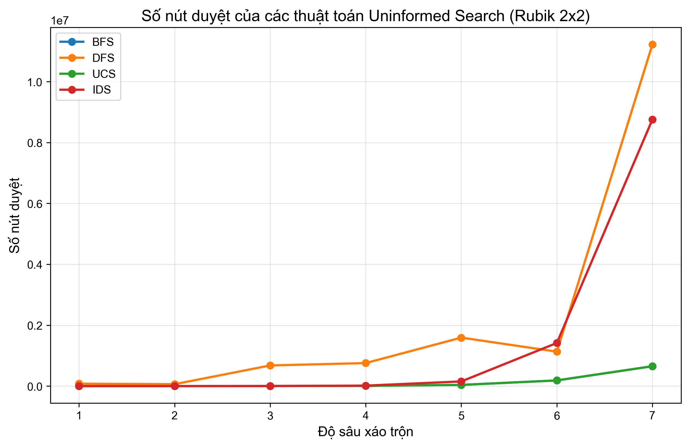
<!-- Biểu đồ trên so sánh số nút đã duyệt của các thuật toán Uninformed Search cho các độ sâu xáo trộn khác nhau -->

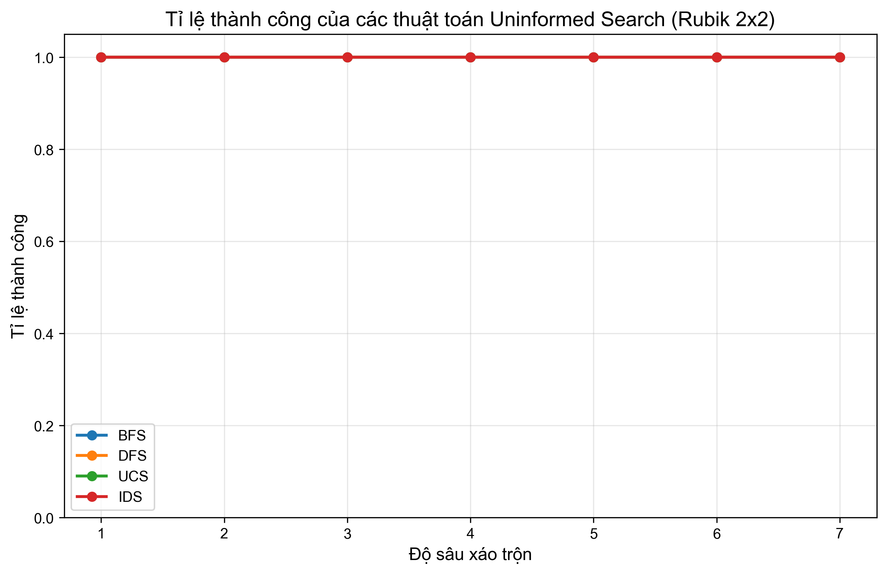
<!-- Biểu đồ trên so sánh tỉ lệ thành công của các thuật toán Uninformed Search cho các độ sâu xáo trộn khác nhau -->

**Biểu đồ so sánh cho Rubik 3x3:**
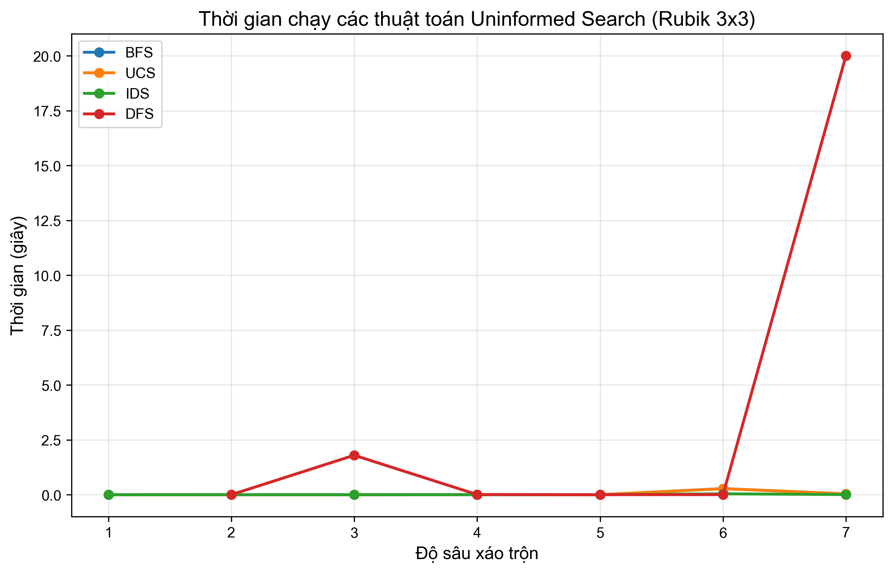
<!-- Biểu đồ trên so sánh thời gian chạy các thuật toán Uninformed Search cho các độ sâu xáo trộn khác nhau -->

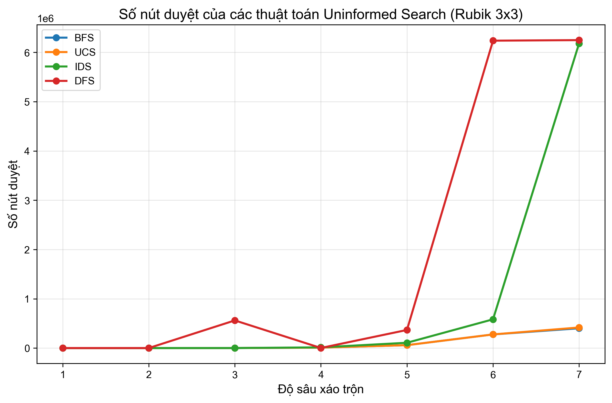
<!-- Biểu đồ trên so sánh số nút đã duyệt của các thuật toán Uninformed Search cho các độ sâu xáo trộn khác nhau -->

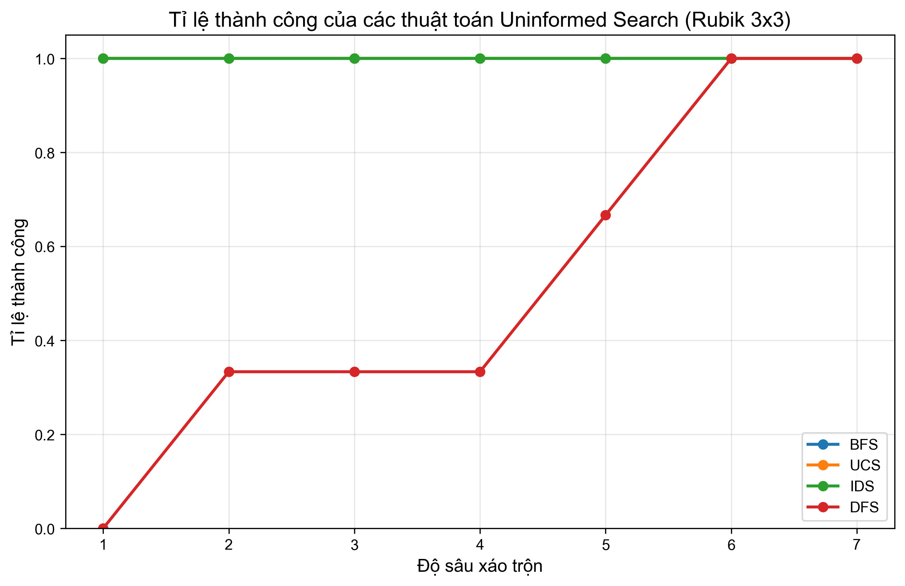
<!-- Biểu đồ trên so sánh tỉ lệ thành công của các thuật toán Uninformed Search cho các độ sâu xáo trộn khác nhau -->

### Nhóm 2: Tìm kiếm có thông tin (Informed/Heuristic Search)

**Các thuật toán đã triển khai:**
- A* (A-star)
- IDA* (Iterative Deepening A*)
- Greedy Best-First Search

**Đặc điểm lý thuyết:**
- **Tính hoàn chỉnh:** A*, IDA* đảm bảo tìm được lời giải nếu tồn tại. Greedy Best-First không đảm bảo.
- **Tính tối ưu:** A* và IDA* đảm bảo tìm được lời giải tối ưu nếu heuristic là admissible (không đánh giá quá). Greedy Best-First không đảm bảo tối ưu.
- **Độ phức tạp thời gian:** Phụ thuộc vào chất lượng của heuristic.
- **Độ phức tạp không gian:** A* tốn nhiều bộ nhớ O(b^d) trong trường hợp xấu nhất. IDA* tối ưu hơn với O(d).

**Kết quả thực nghiệm:**
- A* với heuristic cơ bản có hiệu quả tốt cho Rubik 2x2, thường tìm được lời giải ngắn hơn với số nút duyệt ít hơn so với các thuật toán không thông tin.
- IDA* cải thiện đáng kể vấn đề bộ nhớ của A* và hoạt động hiệu quả trong nhiều trường hợp trên Rubik 2x2.
- Greedy Best-First Search có xu hướng tìm lời giải nhanh hơn A* nhưng không đảm bảo tìm được lời giải tối ưu.

**Biểu đồ so sánh cho Rubik 2x2:**
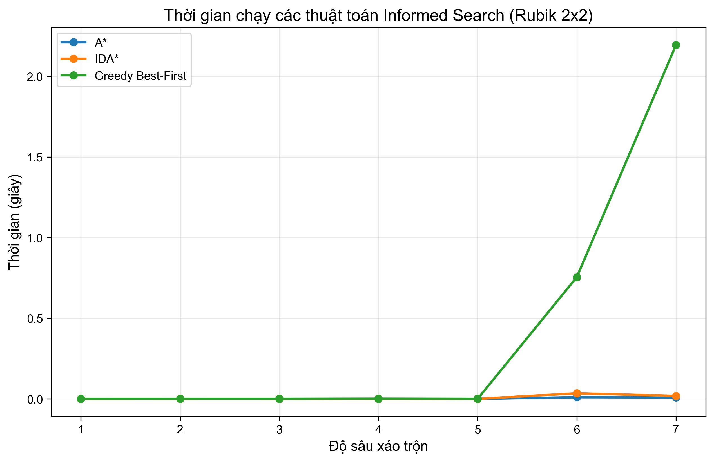
<!-- Biểu đồ trên so sánh thời gian chạy các thuật toán Informed Search cho các độ sâu xáo trộn khác nhau -->

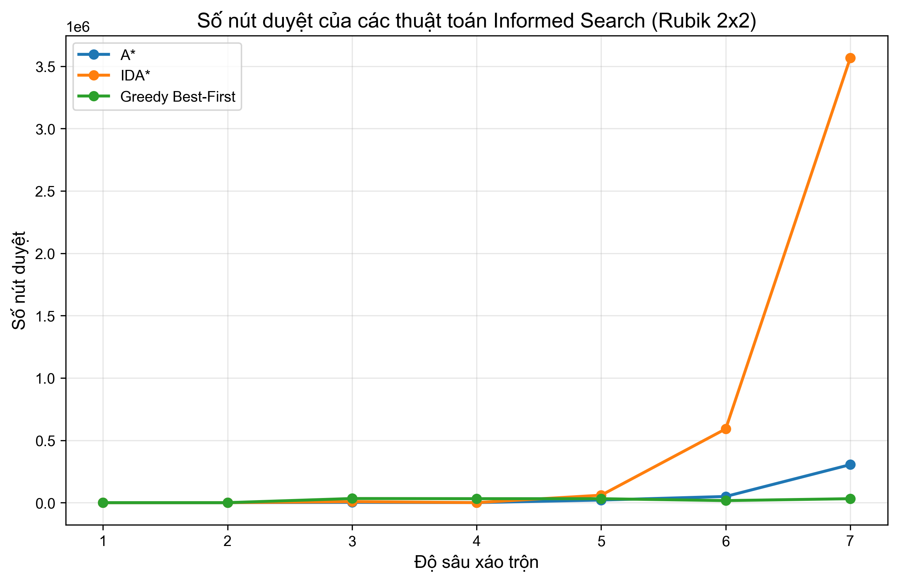
<!-- Biểu đồ trên so sánh số nút đã duyệt của các thuật toán Informed Search cho các độ sâu xáo trộn khác nhau -->

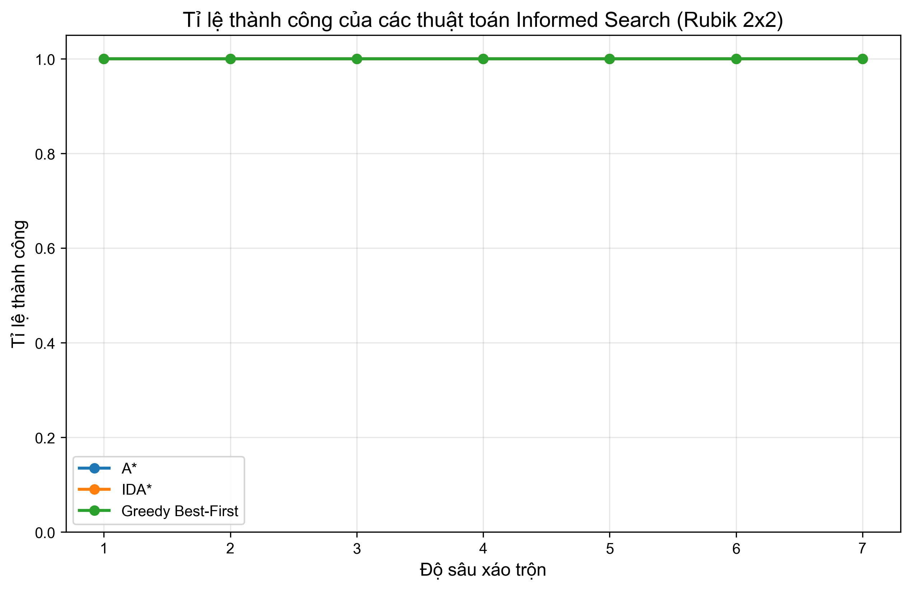
<!-- Biểu đồ trên so sánh tỉ lệ thành công của các thuật toán Informed Search cho các độ sâu xáo trộn khác nhau -->

**Biểu đồ so sánh cho Rubik 3x3:**

<!-- Biểu đồ trên so sánh thời gian chạy các thuật toán Informed Search cho các độ sâu xáo trộn khác nhau -->

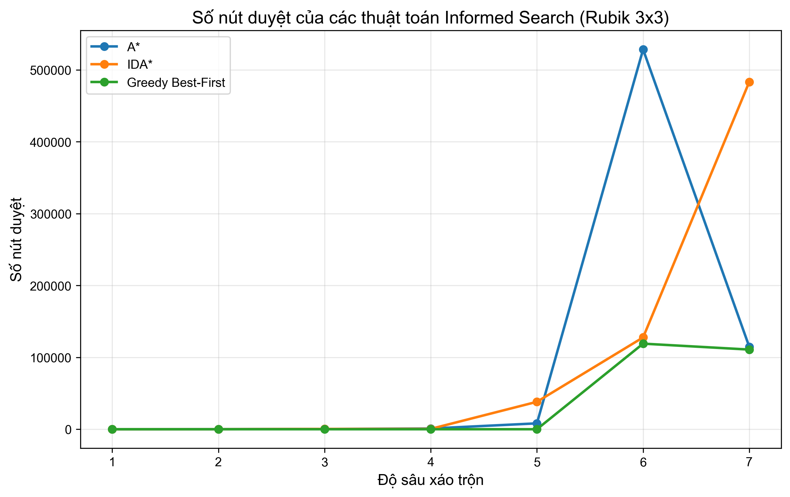
<!-- Biểu đồ trên so sánh số nút đã duyệt của các thuật toán Informed Search cho các độ sâu xáo trộn khác nhau -->

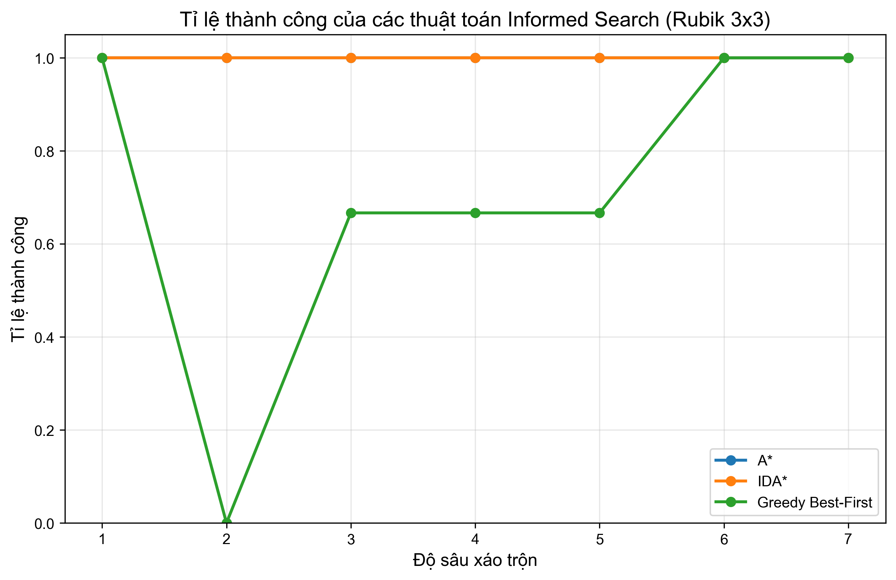
<!-- Biểu đồ trên so sánh tỉ lệ thành công của các thuật toán Informed Search cho các độ sâu xáo trộn khác nhau -->

## Công việc tương lai

- Triển khai Pattern Database (PDB) cho Rubik 3x3
- Tối ưu hóa hiệu năng thuật toán để giải các trạng thái phức tạp hơn
- Cải thiện giao diện người dùng và bổ sung thêm tùy chọn tùy chỉnh
- Thêm chức năng xuất/nhập trạng thái khối Rubik
- Phát triển các phương pháp giải dựa trên phương pháp của con người (phương pháp layer-by-layer)

## Giấy phép

Dự án này được phân phối dưới giấy phép MIT. Xem file [LICENSE](LICENSE) để biết thêm chi tiết.

## Liên hệ

- **Tác giả:** [Tên của bạn]
- **GitHub:** [github.com/username](https://github.com/username)
- **Email:** [your.email@example.com](mailto:your.email@example.com)
- **LinkedIn:** [linkedin.com/in/username](https://linkedin.com/in/username)
